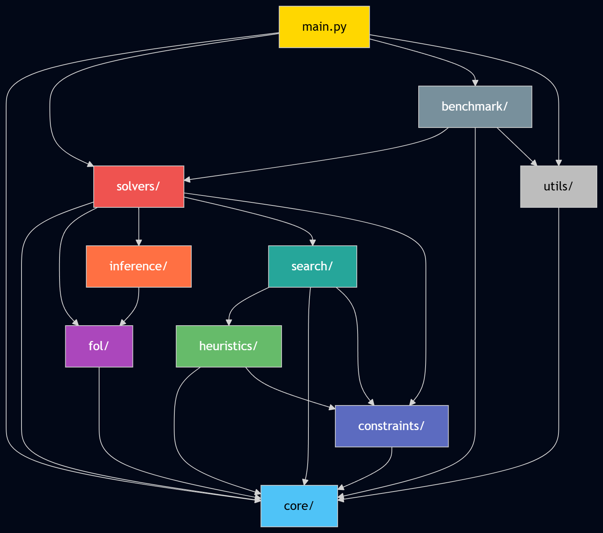
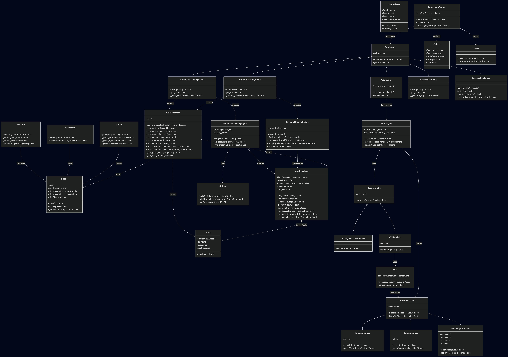

# Directory Structure

```
Source/
├── main.py                          # Entry point, CLI argument handling
│
├── core/
│   ├── __init__.py
│   ├── puzzle.py                    # Puzzle dataclass (grid, constraints, N)
│   ├── parser.py                    # Reads input-XX.txt → Puzzle object
│   └── formatter.py                 # Formats solved Puzzle → output string/file
│
├── fol/
│   ├── __init__.py
│   ├── predicates.py                # Val, Given, LessH, GreaterH, LessV, GreaterV, Less
│   ├── axioms.py                    # FOL axiom definitions (A1–A7+)
│   ├── kb.py                        # KnowledgeBase class (add/query facts & rules)
│   └── cnf_generator.py             # Grounds FOL axioms → CNF clauses for any N
│
├── solvers/
│   ├── __init__.py
│   ├── base_solver.py               # Abstract BaseSolver
│   ├── brute_force_solver.py
│   ├── backtracking_solver.py
│   ├── forward_chaining_solver.py
│   ├── backward_chaining_solver.py
│   └── astar_solver.py
│
├── inference/
│   ├── __init__.py
│   ├── forward_chaining.py          # FC engine (modus ponens loop)
│   ├── backward_chaining.py         # BC engine (SLD resolution)
│   └── unifier.py                   # Unification algorithm
│
├── heuristics/
│   ├── __init__.py
│   ├── base_heuristic.py            # Abstract BaseHeuristic
│   ├── unassigned_count.py          # h = unassigned cells
│   └── ac3_heuristic.py             # h = cells with empty domain after AC-3
│
├── search/
│   ├── __init__.py
│   ├── state.py                     # SearchState (partial assignment, g, h, parent)
│   └── astar.py                     # A* engine
│
├── constraints/
│   ├── __init__.py
│   ├── constraint.py                # Abstract BaseConstraint
│   ├── row_uniqueness.py
│   ├── col_uniqueness.py
│   ├── inequality_constraint.py
│   └── ac3.py                       # AC-3 propagation
│
├── benchmark/
│   ├── __init__.py
│   ├── runner.py                    # Runs all solvers, collects metrics
│   └── metrics.py                   # Time, memory, inferences, expansions
│
└── utils/
    ├── __init__.py
    ├── logger.py                    # Structured logging
    └── validator.py                 # Validates completed grid
```

# Futoshiki — Component Relationships

## 1. Package Dependency Diagram


## 2. Class Diagram


## 3. Communication

| From → To | Relationship | Communication |
|---|---|---|
| `main.py` → `Parser` | Uses | Calls `parse()` to create `Puzzle` |
| `main.py` → `BaseSolver` | Uses (polymorphic) | Calls `solve(puzzle)` on any solver subclass |
| `main.py` → `Formatter` | Uses | Calls `write()` to save solution |
| `main.py` → `BenchmarkRunner` | Uses | Calls `run_all()` for comparison mode |
| `ForwardChainingSolver` → `CNFGenerator` | Creates | Builds ground CNF KB from puzzle |
| `CNFGenerator` → `KnowledgeBase` | Creates & populates | Adds clauses and facts per axiom |
| `CNFGenerator` → `Literal` | Creates | Constructs Val, Less, etc. literals |
| `ForwardChainingSolver` → `ForwardChainingEngine` | Creates & delegates | Passes KB, calls `run()` |
| `ForwardChainingEngine` → `KnowledgeBase` | Mutates | Adds facts, removes satisfied clauses |
| `BackwardChainingSolver` → `BackwardChainingEngine` | Creates & delegates | Passes KB + goals |
| `BackwardChainingEngine` → `Unifier` | Uses | Unification during SLD resolution |
| `AStarSolver` → `AStarEngine` | Delegates | Passes puzzle + heuristic |
| `AStarEngine` → `BaseHeuristic` | Queries | Calls `estimate()` per state |
| `AStarEngine` → `BaseConstraint` | Queries | Calls `is_satisfied()` to validate successors |
| `AC3Heuristic` → `AC3` | Uses | Runs arc consistency for tighter h |
| `AC3` → `BaseConstraint` | Iterates | Checks all constraints during propagation |
| `BenchmarkRunner` → `BaseSolver` | Iterates | Runs each solver, collects `Metrics` |
| `Validator` → `Puzzle` | Reads | Checks row/col/inequality rules |
