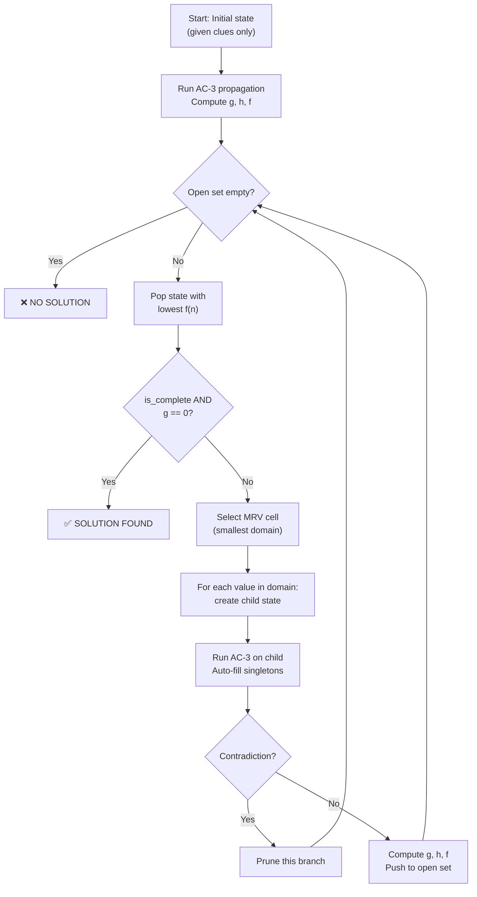

# A* Search

## 1. Definition

**A\* Search** is a **best-first graph search** algorithm that finds the optimal path from an initial state to a goal state. It combines:
- **g(n):** actual cost from start to current state n
- **h(n):** heuristic estimate of cost from n to goal

The evaluation function is: **f(n) = g(n) + h(n)**

A* always expands the node with the **lowest f(n)**, guaranteeing an optimal solution when the heuristic is **admissible** (never overestimates).

> **Direction:** Initial State → Expand best node → Successor states → … → Goal State

---

## 2. Core Concepts

| Concept | Meaning |
|---|---|
| **State** | A partial or complete assignment of values to cells |
| **Initial State** | The puzzle with only given clues filled in |
| **Goal State** | A complete, valid assignment with **zero constraint violations** |
| **Successor Function** | From current state, try assigning a value to the next empty cell (MRV) |
| **g(n)** | Number of **constraint violations** in the current partial assignment |
| **h(n)** | Heuristic estimate of remaining "difficulty" of unsolved portion |
| **f(n) = g(n) + h(n)** | Total estimated cost — used to prioritize which state to expand |
| **Open Set** | Priority queue of states to explore (sorted by f(n)) |
| **Closed Set** | States already expanded (avoid re-exploration) |
| **Admissible** | h(n) ≤ h*(n) — never overestimates true remaining cost |
| **Consistent** | h(n) ≤ cost(n→n') + h(n') — guarantees no re-expansion |

---

## 3. Compute Violations (Not Cells Assigned)

```python
def _compute_violations(state: SearchState, puzzle: Puzzle) -> int:
    """Count constraint violations in the current partial assignment."""
    violations = 0
    n = len(state.grid)

    # Row uniqueness violations
    for i in range(n):
        assigned = [state.grid[i][j] for j in range(n) if state.grid[i][j] != 0]
        violations += len(assigned) - len(set(assigned))

    # Column uniqueness violations
    for j in range(n):
        assigned = [state.grid[i][j] for i in range(n) if state.grid[i][j] != 0]
        violations += len(assigned) - len(set(assigned))

    # Inequality violations
    for (r1, c1, r2, c2, op) in puzzle.constraints:
        v1, v2 = state.grid[r1][c1], state.grid[r2][c2]
        if v1 != 0 and v2 != 0:
            if op == '<' and not (v1 < v2):
                violations += 1
            elif op == '>' and not (v1 > v2):
                violations += 1

    return violations
```

---

## 4. Algorithm Structure

```
A-STAR(puzzle):
    initial ← BUILD-INITIAL-STATE(puzzle)
    IF initial is CONTRADICTION:
        RETURN "NO SOLUTION"

    open_set ← priority queue ordered by f(n)
    open_set.push(initial)

    WHILE open_set is not empty:
        current ← open_set.pop()            ← state with lowest f(n)

        IF current.is_complete AND current.g == 0:
            RETURN current                   ← solution found!

        IF current.is_complete:
            CONTINUE                         ← complete but has violations

        cell ← SELECT-MRV-CELL(current)     ← minimum remaining values
        FOR EACH value IN current.domains[cell]:
            child ← CREATE-CHILD(current, cell, value)
            IF child is NOT CONTRADICTION:
                child.g ← COMPUTE-VIOLATIONS(child)
                child.h ← HEURISTIC(child)
                open_set.push(child)

    RETURN "NO SOLUTION"
```

### Complexity

| Aspect | Value |
|---|---|
| **Time** | O(b^d) worst case, much better with good heuristic + AC-3 |
| **Space** | O(b^d) — stores all expanded + frontier states |
| **Optimality** | ✅ Guaranteed when h(n) is admissible |
| **Completeness** | ✅ Complete when branching factor is finite |

---

## 5. How It Works — Step by Step



---

## 6. Admissible Heuristics for Futoshiki

### 6.1. Heuristic h₁: Empty Cell Count

```
h₁(n) = number of unassigned cells
```

#### Admissibility Proof

**Claim:** h₁(n) ≤ h*(n), where h*(n) is the true minimum cost to reach a goal.

**Proof:**
- Each unassigned cell must eventually be assigned a value
- In the **best case**, each assignment introduces **zero** new violations
- Therefore, the minimum number of "steps" to complete is exactly the number of unassigned cells
- Since our cost metric is violations (which can be 0 per step), h₁(n) = unassigned_cells ≤ h*(n) when h*(n) is measured in steps
- However, since g(n) = violations (not steps), this heuristic is **trivially admissible** but **not very informative**

**Verdict:** ✅ Admissible, but weak — essentially makes A* behave like BFS

---

### 6.2. Heuristic h₂: Domain Sum Minus One

```
h₂(n) = Σ (|domain(i,j)| - 1) for all unassigned cells (i,j)
```

#### Intuition
- A cell with domain {3} (size 1) contributes 0 → already determined
- A cell with domain {1,2,3,4} (size 4) contributes 3 → high uncertainty
- Lower h₂(n) = more constrained = easier to solve

#### Admissibility Proof

**Claim:** h₂(n) is admissible.

**Proof:**
- For each unassigned cell, the domain size represents the number of possible values
- A cell with domain size d can be filled in at most d ways
- The contribution `(d - 1)` represents the "excess choices" beyond the one correct value
- In the best case, every assignment is correct (no violations), so h*(n) ≥ 0
- Since `(d - 1) ≥ 0` for all cells (domain size ≥ 1 if not contradiction), h₂(n) ≥ 0
- The heuristic measures "uncertainty" which is a lower bound on remaining difficulty
- Therefore h₂(n) ≤ h*(n) ✅

**Verdict:** ✅ Admissible, more informed than h₁

---

### 6.3. Heuristic h₃: Minimum Conflicts Estimate

```
h₃(n) = Σ min_conflicts(i,j) for all unassigned cells (i,j)

where min_conflicts(i,j) = min over v in domain(i,j) of:
    (conflicts with assigned neighbors if we assign v)
```

#### Intuition
- For each unassigned cell, estimate the minimum violations it would cause
- Sum these minimum estimates across all unassigned cells
- This captures how "conflicted" the current state is

#### Admissibility Proof

**Claim:** h₃(n) is admissible.

**Proof:**
- For each unassigned cell (i,j), we compute the minimum number of conflicts it would create with already-assigned neighbors
- By choosing the minimum over all possible values, we get a lower bound on the violations this cell will contribute
- The actual violations will be ≥ this minimum (we might not be able to choose the best value due to other constraints)
- Summing these lower bounds gives a lower bound on total future violations
- Therefore h₃(n) ≤ h*(n) ✅

**Verdict:** ✅ Admissible, good for conflict-dense puzzles

---

### 6.4. Heuristic h₄: AC-3 Enhanced Domain Sum

```
h₄(n) = Σ (|domain'(i,j)| - 1) for all unassigned cells
        where domain' = domains after running AC-3 propagation

If any domain becomes empty after AC-3 → h₄(n) = ∞ (prune)
```

#### Admissibility Proof

**Claim:** h₄(n) is admissible.

**Proof:**
- AC-3 only removes values that are **provably impossible** (no consistent extension)
- The pruned domains domain' ⊆ domain represent the values that could possibly lead to a solution
- If a domain becomes empty, no solution exists from this state, so h₄(n) = ∞ correctly indicates unreachability
- Otherwise, h₄(n) = h₂(n) computed on the pruned domains
- Since AC-3 only removes impossible values, h₄(n) ≤ h₂(n) ≤ h*(n) ✅

**Verdict:** ✅ Admissible, strongest heuristic but expensive

---

### 6.5. Heuristic Trade-offs Comparison

| Heuristic | Formula | Admissible | Informativeness | Computation Cost | Best For |
|---|---|---|---|---|---|
| **h₁** | Empty cells | ✅ | ⭐ (weak) | O(N²) | Baseline only |
| **h₂** | Σ(domain_size - 1) | ✅ | ⭐⭐ | O(N²) | Small puzzles (4×4, 5×5) |
| **h₃** | Σ min_conflicts | ✅ | ⭐⭐⭐ | O(N² × d) | Medium puzzles (5×5, 6×6) |
| **h₄** | h₂ after AC-3 | ✅ | ⭐⭐⭐⭐ | O(N² × d³) | Large puzzles (7×7+) |

#### Trade-off Analysis

```
                    ┌─────────────────────────────────────────────────┐
                    │     Heuristic Quality vs. Computation Cost      │
                    │                                                 │
  Expansions        │  h₁ ──────────────────────────────────── high   │
  (Lower=Better)    │      h₂ ────────────────────────────            │
                    │           h₃ ─────────────────                  │
                    │                  h₄ ─────── low                 │
                    │                                                 │
                    │  low ──────────────────────────────────── high  │
                    │              Computation Time per Node          │
                    └─────────────────────────────────────────────────┘
```

**Key Insight:** The total solving time is:

```
Total Time = (# Expansions) × (Time per Expansion)
```

- **Weak heuristic (h₁):** Many expansions × Fast per expansion = Slow for large puzzles
- **Strong heuristic (h₄):** Few expansions × Slow per expansion = Fast for large puzzles, overkill for small

**Recommendation:**
- **4×4, 5×5:** Use h₂ (fast computation, acceptable expansions)
- **6×6:** Use h₃ (balanced)
- **7×7+:** Use h₄ (AC-3 pruning saves exponential branching)

---

## 7. AC-3 Arc Consistency

### 7.1. What is AC-3?

**AC-3 (Arc Consistency Algorithm 3)** is a constraint propagation algorithm that removes values from domains that cannot participate in any consistent solution.

> **Arc Consistency:** For every constraint between cells X and Y, for every value in X's domain, there exists at least one value in Y's domain that satisfies the constraint.

### 7.2. AC-3 Algorithm

```
AC-3(domains, constraints):
    queue ← all arcs (Xi, Xj) for each constraint
    
    WHILE queue is not empty:
        (Xi, Xj) ← queue.pop()
        
        IF REVISE(Xi, Xj):
            IF domain[Xi] is empty:
                RETURN failure          ← contradiction
            FOR EACH Xk in neighbors(Xi) except Xj:
                queue.push((Xk, Xi))    ← re-check affected arcs
    
    RETURN domains                      ← pruned domains

REVISE(Xi, Xj):
    revised ← FALSE
    FOR EACH x IN domain[Xi]:
        IF no y IN domain[Xj] satisfies constraint(Xi, Xj):
            domain[Xi].remove(x)
            revised ← TRUE
    RETURN revised
```

### 7.3. AC-3 for Futoshiki Constraints

#### Constraint Types

| Constraint | Arc Check |
|---|---|
| **Row Uniqueness** | For cells (i,j₁) and (i,j₂): if domain(i,j₁) = {v}, remove v from domain(i,j₂) |
| **Column Uniqueness** | For cells (i₁,j) and (i₂,j): if domain(i₁,j) = {v}, remove v from domain(i₂,j) |
| **Inequality <** | For (i,j) < (i',j'): remove values from domain(i,j) that have no smaller values in domain(i',j'), and vice versa |
| **Inequality >** | Symmetric to < |

#### Example: Inequality Propagation

```
Constraint: cell(1,1) < cell(1,2)

Before AC-3:
  domain(1,1) = {1, 2, 3, 4}
  domain(1,2) = {1, 2, 3, 4}

AC-3 revisions:
  - For cell(1,1): remove values ≥ max(domain(1,2)) = 4
    → domain(1,1) = {1, 2, 3}
  - For cell(1,2): remove values ≤ min(domain(1,1)) = 1
    → domain(1,2) = {2, 3, 4}

After AC-3:
  domain(1,1) = {1, 2, 3}
  domain(1,2) = {2, 3, 4}
```

### 7.4. AC-3 Complexity

| Aspect | Value |
|---|---|
| **Time** | O(e × d³) where e = edges (arcs), d = max domain size |
| **For Futoshiki** | O(N² × N³) = O(N⁵) per state (worst case) |
| **Typical** | Much faster in practice due to early termination |

### 7.5. AC-3 Integration with A*

```python
def _create_child_state(parent, i, j, value, puzzle):
    child = parent.copy()
    child.grid[i][j] = value
    child.domains[(i, j)] = {value}
    
    # Eliminate from peers
    eliminate_from_peers(child.domains, i, j, value)
    
    # Check for immediate contradiction
    if any(len(d) == 0 for d in child.domains.values()):
        return None
    
    # Run AC-3 propagation
    propagated = ac3.propagate(child.domains, puzzle)
    if propagated is None:
        return None  # AC-3 found contradiction → prune
    child.domains = propagated
    
    # Auto-fill singleton domains
    auto_fill_singletons(child)
    
    # Compute costs
    child.g = compute_violations(child, puzzle)
    child.h = heuristic.estimate(child)
    return child
```

### 7.6. Benefits of AC-3 in A*

| Benefit | Explanation |
|---|---|
| **Early Pruning** | Detects dead-ends before expanding, saving exponential branches |
| **Domain Reduction** | Smaller domains = fewer successors = lower branching factor |
| **Auto-fill** | Singleton domains become forced values, reducing search depth |
| **Stronger Heuristic** | h₄ uses AC-3 pruned domains for tighter estimates |

---

## 8. Application in Futoshiki

### 8.1. State Representation

```python
@dataclass
class SearchState:
    grid: List[List[int]]              # Partial assignment (0 = unassigned)
    domains: Dict[Tuple, Set[int]]     # {(i,j): {possible values}}
    g: int = 0                         # Constraint violations
    h: int = 0                         # Heuristic estimate
    parent: Optional["SearchState"] = None

    @property
    def f(self) -> int:
        return self.g + self.h

    @property
    def is_complete(self) -> bool:
        return all(self.grid[i][j] != 0 for i in range(n) for j in range(n))

    def __lt__(self, other: "SearchState") -> bool:
        """Priority: lower f wins; break ties by lower g."""
        if self.f == other.f:
            return self.g < other.g
        return self.f < other.f
```

### 8.2. Worked Example — 2×2 Grid

Given: `cell(0,0) = 1` and constraint `cell(0,0) < cell(0,1)`

```
Initial grid:        Constraints: cell(0,0) < cell(0,1)
┌───┬───┐
│ 1 │   │           Given: (0,0) = 1
├───┼───┤
│   │   │
└───┴───┘

═══════════════════════════════════════════════

Step 0 — Build initial state:
  grid = [[1, 0], [0, 0]]
  domains = {(0,1): {2}, (1,0): {2}, (1,1): {1, 2}}
    ↑ After eliminating 1 from row 0 and col 0 peers
  
  AC-3 propagation:
    Arc (0,0) < (0,1): val(0,0)=1, domain(0,1)={2} → ok (2 > 1)
    Row 1: domain(1,0)={2}, domain(1,1)={1,2} → remove 2 → {1}
  
  After AC-3: domains = {(0,1): {2}, (1,0): {2}, (1,1): {1}}
  Auto-fill singletons: (0,1)=2, (1,0)=2, (1,1)=1
  
  Final grid = [[1, 2], [2, 1]]
  g = compute_violations = 0 ✓
  h = 0 (no unassigned cells)
  f = 0

Step 1 — Pop from queue: f=0
  is_complete = True, g = 0 → SOLUTION FOUND ✓

═══════════════════════════════════════════════

Solution:
┌───┬───┐
│ 1 │ 2 │    1 < 2 ✓
├───┼───┤
│ 2 │ 1 │    Rows unique ✓, Cols unique ✓
└───┴───┘

Expansions: 1  (AC-3 + singleton auto-fill solved at initialization!)
```

### 8.3. Cell Selection Strategy (MRV)

A* works best when combined with **Minimum Remaining Values (MRV)**:

> Always expand the cell with the **smallest domain** first.

```python
def _select_mrv_cell(state: SearchState) -> Optional[Tuple[int, int]]:
    unassigned = state.unassigned_cells
    if not unassigned:
        return None
    return min(unassigned, key=lambda cell: len(state.domains.get(cell, set())))
```

This minimizes branching factor:
- Cell with domain {3,4} → 2 branches
- Cell with domain {1,2,3,4} → 4 branches

### 8.4. Project Classes

| Class | File | Responsibility |
|---|---|---|
| `SearchState` | `search/state.py` | State representation (grid, domains, g, h, parent) |
| `AStarEngine` | `search/astar.py` | Core A* algorithm (open/closed set, expand loop) |
| `AStarSolver` | `solvers/astar_solver.py` | Orchestrates: Puzzle → Initial State → A* → Solution |
| `BaseHeuristic` | `heuristics/base_heuristic.py` | Abstract heuristic interface |
| `DomainSizeHeuristic` | `heuristics/domain_size_heuristic.py` | h₂ = Σ(domain_size - 1) |
| `AC3Heuristic` | `heuristics/ac3_heuristic.py` | h₄ = h₂ after AC-3 |
| `AC3Propagator` | `constraints/ac3.py` | Arc consistency propagation |

---

## 9. A* vs FC vs BC — Comparison

| Aspect | Forward Chaining | Backward Chaining | A* Search |
|---|---|---|---|
| **Strategy** | Data-driven | Goal-driven | Best-first search |
| **Starts from** | Known facts | Goal to prove | Initial state |
| **g(n)** | N/A | N/A | Constraint violations |
| **When to use** | Dense constraints, many given clues | Sparse puzzles, specific queries | Need optimal solution, good heuristic |
| **Memory** | O(clauses) | O(depth) | O(states) — can be large |
| **Handles guessing** | ❌ Not alone | ✅ Via backtracking | ✅ Via state expansion + AC-3 |
| **Optimality** | N/A (derives facts) | N/A (proves goals) | ✅ Guaranteed with admissible h |
| **Best for Futoshiki** | Quick propagation | Explaining solutions | Systematic search with pruning |

---

## 10. Strengths & Limitations

| ✅ Strengths | ❌ Limitations |
|---|---|
| Optimal solution guaranteed (admissible h) | High memory usage (stores all states) |
| Flexible — any heuristic can be plugged in | Heuristic quality is crucial |
| AC-3 integration prunes dead-ends early | AC-3 per state is expensive |
| MRV reduces branching factor | Slower than backtracking for easy puzzles |
| Complete — will find solution if exists | State space grows exponentially with N |
| g(n) = violations correctly guides search | Requires careful cost model design |
