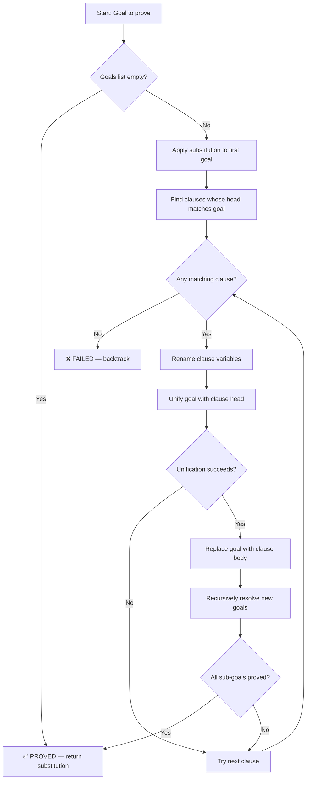
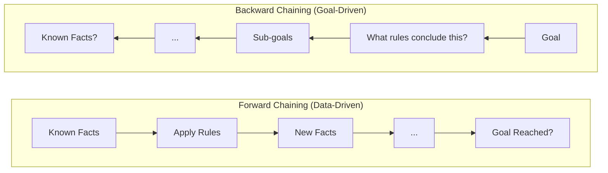
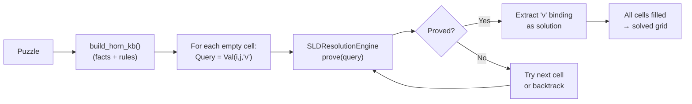

# Backward Chaining (BC)

## 1. Definition

**Backward Chaining** is a **goal-driven** inference method. Instead of starting from known facts and working forward, it starts from the **goal** (what we want to prove) and works **backward** — asking "what do I need to prove to establish this goal?"

> **Direction:** Goal → Sub-goals → Sub-sub-goals → … → Known Facts

It uses **SLD Resolution** (Selective Linear Definite clause resolution): given a goal, find a rule whose conclusion matches the goal, then recursively prove all premises of that rule.

---

## 2. Core Concepts

| Concept | Meaning |
|---|---|
| **Goal** | A literal we want to prove true (e.g., `Val(2,3,4)`) |
| **Sub-goal** | A premise that must be proven to satisfy a rule |
| **Horn Clause** | `head :- body₁, body₂, …, bodyₖ` (Prolog notation); logically: `body₁ ∧ body₂ ∧ … ⇒ head` |
| **Unification** | Matching a goal with a rule's head by substituting variables |
| **SLD Resolution** | Resolving a goal against a definite clause (Horn clause with exactly one positive literal) |
| **Proof Tree** | The tree of goals → sub-goals → facts that constitutes a proof |
| **Backtracking** | When a sub-goal fails, try alternative rules for the parent goal |

---

## 3. Algorithm Structure

### SLD Resolution Algorithm (Prolog-style)

```
SLD-RESOLVE(goals, subst, depth):
    IF depth > DEPTH_LIMIT:
        RETURN failure                      ← prevent infinite recursion

    IF goals is EMPTY:
        RETURN subst                        ← all goals proved, return bindings

    current_goal ← APPLY(subst, goals[0])
    remaining_goals ← goals[1:]

    FOR EACH clause IN KB.get_clauses_for(current_goal.name):
        renamed_clause ← RENAME_VARIABLES(clause)  ← prevent variable capture

        new_subst ← MATCH(current_goal, renamed_clause.head)
        IF new_subst is failure:
            CONTINUE                        ← try next clause

        merged ← MERGE(subst, new_subst)
        new_goals ← [APPLY(merged, b) FOR b IN renamed_clause.body] + remaining_goals

        result ← SLD-RESOLVE(new_goals, merged, depth + 1)
        IF result is NOT failure:
            RETURN result                   ← goal proved via this clause

    RETURN failure                          ← all clauses exhausted, backtrack
```

### Unification Algorithm (with match vs resolve)

The `Unifier` class provides **two operations**:

1. **`match(l1, l2)`** — for SLD resolution (same predicate, same sign)
   - Used to unify a GOAL with a clause HEAD
   - Both must have the same name AND same negation sign

2. **`resolve(l1, l2)`** — for propositional resolution (opposite sign)
   - Used to resolve complementary literals
   - Both must have the same name BUT opposite negation

```
MATCH(l1, l2):
    IF l1.name ≠ l2.name:        RETURN failure
    IF l1.negated ≠ l2.negated:  RETURN failure   ← SLD requires same sign
    IF len(l1.args) ≠ len(l2.args): RETURN failure
    
    subst ← {}
    FOR (a1, a2) IN zip(l1.args, l2.args):
        subst ← UNIFY-ARGS(a1, a2, subst)
        IF subst is failure: RETURN failure
    RETURN subst

UNIFY-ARGS(x, y, θ):
    x ← APPLY(θ, x)              ← follow binding chain
    y ← APPLY(θ, y)
    
    IF x = y:                    RETURN θ
    IF IS-VARIABLE(x):           RETURN EXTEND(θ, x, y)
    IF IS-VARIABLE(y):           RETURN EXTEND(θ, y, x)
    RETURN failure               ← two different constants

IS-VARIABLE(x):
    RETURN x is a lowercase string (e.g., "v", "i", "j")
    # Constants are integers or uppercase strings
```

> [!IMPORTANT]
> **Variable convention (Prolog-style):**
> - Variables are **lowercase strings** in `Literal.args`: `Literal("Val", (0, 1, "v"))`
> - Constants are **integers** or **uppercase strings**: `(0, 1, 2)` — all constants

### Complexity

| Aspect | Value |
|---|---|
| **Time** | O(bᵈ) where b = branching factor, d = proof depth |
| **Space** | O(d) for the recursion stack (depth-first) |
| **Completeness** | ✅ Complete for definite clauses (with depth limit) |
| **Soundness** | ✅ Every proven goal follows logically |

---

## 4. How It Works — Step by Step



### FC vs BC — Visual Comparison



---

## 5. Application in Futoshiki

### 5.1. Horn Clause Representation

In BC for Futoshiki, we use **Horn clauses** with a `NotVal` predicate for negative information:

```python
@dataclass
class HornClause:
    """A Horn clause: head :- body₁, body₂, ..., bodyₖ.

    Prolog notation:  head :- body1, body2, ..., bodyk.
    Logical reading:  body1 ∧ body2 ∧ ... ∧ bodyk → head
    """
    head: Literal         # The conclusion (a single positive literal)
    body: List[Literal]   # The premises (conditions to prove)

    def is_fact(self) -> bool:
        return len(self.body) == 0
```

### 5.2. Building the Horn Clause KB

```python
def build_horn_kb(puzzle: "Puzzle") -> HornClauseKB:
    """Convert a Futoshiki puzzle into Horn clauses."""
    kb = HornClauseKB()
    n = puzzle.n

    # --- A9: Given clue facts ---
    for i in range(n):
        for j in range(n):
            if puzzle.grid[i][j] != 0:
                v = puzzle.grid[i][j]
                kb.add_fact(Literal("Val", (i, j, v)))

    # --- A11: Less ground truth facts ---
    for a in range(1, n + 1):
        for b in range(a + 1, n + 1):
            kb.add_fact(Literal("Less", (a, b)))

    # --- A1: Cell existence rules ---
    # Val(i, j, v) :- NotVal(i, j, v1), NotVal(i, j, v2), ...
    for i in range(n):
        for j in range(n):
            for v in range(1, n + 1):
                others = [v2 for v2 in range(1, n + 1) if v2 != v]
                body = [Literal("NotVal", (i, j, v2)) for v2 in others]
                kb.add_rule(Literal("Val", (i, j, v)), body)

    # --- A3: Row uniqueness → NotVal ---
    for i in range(n):
        for j1 in range(n):
            for j2 in range(n):
                if j1 != j2:
                    for v in range(1, n + 1):
                        kb.add_rule(
                            Literal("NotVal", (i, j1, v)),
                            [Literal("Val", (i, j2, v))]
                        )

    # --- A4: Column uniqueness → NotVal ---
    for j in range(n):
        for i1 in range(n):
            for i2 in range(n):
                if i1 != i2:
                    for v in range(1, n + 1):
                        kb.add_rule(
                            Literal("NotVal", (i1, j, v)),
                            [Literal("Val", (i2, j, v))]
                        )

    # --- A5-A8, A16: Inequality → NotVal ---
    for (r1, c1, r2, c2, op) in puzzle.constraints:
        for v1 in range(1, n + 1):
            for v2 in range(1, n + 1):
                if op == '<' and v1 >= v2:
                    kb.add_rule(
                        Literal("NotVal", (r1, c1, v1)),
                        [Literal("Val", (r2, c2, v2))]
                    )
                    kb.add_rule(
                        Literal("NotVal", (r2, c2, v2)),
                        [Literal("Val", (r1, c1, v1))]
                    )
                elif op == '>' and v1 <= v2:
                    kb.add_rule(
                        Literal("NotVal", (r1, c1, v1)),
                        [Literal("Val", (r2, c2, v2))]
                    )
                    kb.add_rule(
                        Literal("NotVal", (r2, c2, v2)),
                        [Literal("Val", (r1, c1, v1))]
                    )

    return kb
```

### 5.3. The Solving Pipeline



### 5.4. Worked Example — 2×2 Grid (Prolog-style SLD with Unifier)

2×2 Futoshiki: `Given(0,0,1)` and constraint `cell(0,0) < cell(0,1)`.

**Horn Clause KB (relevant subset, all using `Literal` objects):**
```prolog
% Facts
Literal("Val", (0, 0, 1), negated=False)         % Given: cell(0,0) = 1
Literal("Less", (1, 2), negated=False)            % 1 < 2

% Rules (A1: cell existence)
Literal("Val", (0,1,2)) :- Literal("NotVal", (0,1,1)).

% Rules (A3: row uniqueness)
Literal("NotVal", (0,1,1)) :- Literal("Val", (0,0,1)).

% Rules (A16: inequality contrapositive)
Literal("NotVal", (0,1,1)) :- Literal("Val", (0,0,1)).   % 1 >= 1, banned
```

**Query:** `?- Literal("Val", (0, 1, "v"))` — what value does cell(0,1) hold?

```
?- Val(0, 1, "v")
│
├─ Clause: Val(0, 1, 2) :- NotVal(0, 1, 1).
│  Unifier.match(
│    Literal("Val", (0,1,"v")),
│    Literal("Val", (0,1,2))
│  )
│  → _unify_args(0, 0) → ok (same)
│  → _unify_args(1, 1) → ok (same)
│  → _unify_args("v", 2) → "v" is variable → bind
│  θ = {"v": 2} ✓
│
│  New goals: [NotVal(0, 1, 1)]
│  │
│  ├─ Clause: NotVal(0, 1, 1) :- Val(0, 0, 1).
│  │  Unifier.match(
│  │    Literal("NotVal", (0,1,1)),
│  │    Literal("NotVal", (0,1,1))
│  │  )
│  │  → all args identical → θ = {} ✓
│  │
│  │  New goals: [Val(0, 0, 1)]
│  │  │
│  │  ├─ Fact: Val(0, 0, 1).
│  │  │  Unifier.match → all identical → θ = {} ✓
│  │  │  Goals: [] → EMPTY → SUCCESS ✓
│  │  │
│  │  └─ proved ✓
│  │
│  └─ NotVal(0, 1, 1) proved ✓
│
└─ Val(0, 1, 2) proved ✓

Answer: {"v": 2}  →  cell(0,1) = 2 ✓
```

### 5.5. When BC Excels

| Scenario | Why BC is good |
|---|---|
| Specific cell query | Only explores rules relevant to that cell |
| Sparse constraints | Doesn't waste time on unrelated parts of the grid |
| Proof explanation | The proof tree shows *why* a value is correct |

### 5.6. Project Classes

| Class | File | Responsibility |
|---|---|---|
| `HornClause` | `inference/backward_chaining.py` | Represents a single Horn clause (head :- body) |
| `HornClauseKB` | `inference/backward_chaining.py` | Stores Horn clauses indexed by head predicate name |
| `SLDResolutionEngine` | `inference/backward_chaining.py` | Prolog-style SLD resolution with backtracking |
| `Unifier` | `inference/unifier.py` | Unification algorithm with `match()` and `resolve()` methods |
| `BackwardChainingSolver` | `solvers/backward_chaining_solver.py` | Orchestrates: Puzzle → Horn KB → SLD → Solution |

---

## 6. Implementation Details

### 6.1. HornClauseKB Class

```python
class HornClauseKB:
    """Knowledge base of Horn clauses for SLD resolution.

    Indexed by head predicate name for fast clause lookup.
    """
    def __init__(self):
        self._clauses: List[HornClause] = []
        self._index: Dict[str, List[HornClause]] = {}

    def add_clause(self, clause: HornClause) -> None:
        self._clauses.append(clause)
        name = clause.head.name
        if name not in self._index:
            self._index[name] = []
        self._index[name].append(clause)

    def add_fact(self, head: Literal) -> None:
        self.add_clause(HornClause(head=head, body=[]))

    def add_rule(self, head: Literal, body: List[Literal]) -> None:
        self.add_clause(HornClause(head=head, body=body))

    def get_clauses_for(self, predicate_name: str) -> List[HornClause]:
        return self._index.get(predicate_name, [])
```

### 6.2. SLDResolutionEngine Class

```python
class SLDResolutionEngine:
    """Prolog-style backward chaining via SLD resolution.

    SLD Algorithm:
    ──────────────
    1. GOAL: Start with a query literal to prove
    2. SEARCH: Find a clause whose HEAD matches the goal
       (using Unifier.match() — same predicate, same sign)
    3. RESOLVE: Replace the goal with the clause's body
       (apply the unifier's substitution to body literals)
    4. RECURSE: Prove each body literal (left-to-right, depth-first)
    5. BACKTRACK: On failure, try the next matching clause
    """

    def __init__(self, kb: HornClauseKB, depth_limit: int = 100):
        self._kb = kb
        self._unifier = Unifier()
        self._depth_limit = depth_limit
        self._inference_count: int = 0
        self._clause_use_counter: int = 0

    def prove(self, goal: Literal) -> Optional[Substitution]:
        """Prove a goal literal. Returns substitution if proved, None if not."""
        result = self._sld_resolve([goal], {}, depth=0)
        if result is not None:
            self._inference_count += 1
        return result

    def query(self, goal: Literal) -> Generator[Substitution, None, None]:
        """Yield all substitutions that prove the goal (like Prolog's ;)."""
        yield from self._sld_resolve_all([goal], {}, depth=0)
```

### 6.3. BackwardChainingSolver Class

```python
class BackwardChainingSolver(BaseSolver):
    """Orchestrates: Puzzle → Horn Clause KB → SLD Engine → Extract solution.

    For each unassigned cell (i,j), queries ?- Val(i, j, "v") to find
    which value "v" the SLD engine can prove.
    """
    def solve(self, puzzle: "Puzzle") -> Optional["Puzzle"]:
        kb = build_horn_kb(puzzle)
        engine = SLDResolutionEngine(kb)

        for i in range(puzzle.n):
            for j in range(puzzle.n):
                if puzzle.grid[i][j] != 0:
                    continue

                # Query with variable "v" in the value position
                query = Literal("Val", (i, j, "v"), negated=False)
                result = engine.prove(query)

                if result is not None and "v" in result:
                    puzzle.grid[i][j] = result["v"]

        return puzzle if self._is_complete(puzzle) else None

    def get_name(self) -> str:
        return "Backward Chaining (SLD)"
```

---

## 8. Strengths & Limitations

| Strengths | Limitations |
|---|---|
| Goal-directed — only explores relevant rules | Exponential time in worst case (bᵈ) |
| Memory efficient (depth-first, O(d) stack) | May re-prove the same sub-goals repeatedly |
| Natural for "prove this cell's value" queries | Needs depth limit to avoid infinite loops |
| Produces explainable proof trees | Slower than FC for densely constrained puzzles |
| Works well with sparse puzzles | Unification overhead per goal |
