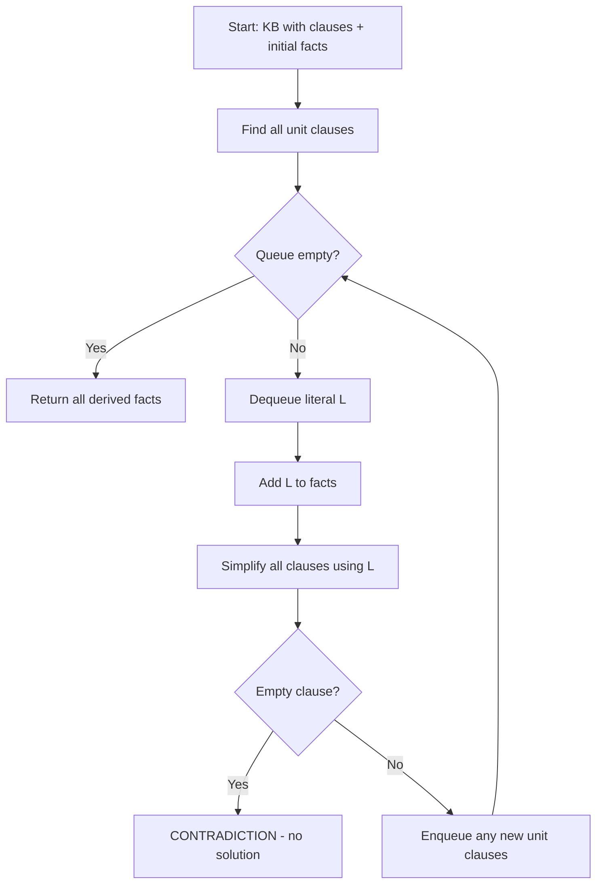
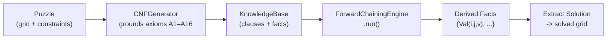

# Forward Chaining (FC)

## 1. Definition

**Forward Chaining** is a **data-driven** inference method. It starts from **known facts** and repeatedly applies inference rules to derive **new facts**, until the goal is reached or no more facts can be derived.

> **Direction:** Facts -> Rules -> New Facts -> … -> Goal

In propositional logic (CNF), forward chaining is implemented via **Unit Propagation**: when a clause has only one literal left, that literal *must* be true - making it a new fact that simplifies all other clauses.

---

## 2. Core Concepts

| Concept | Meaning |
|---|---|
| **Fact** | A ground literal known to be true (e.g., `Val(1,1,3)`) |
| **Rule (Clause)** | A disjunction of literals (e.g., `not Val(1,1,1) ∨ not Val(1,2,1)`) |
| **Unit Clause** | A clause with exactly **one** literal - that literal must be true |
| **Propagation** | Using a new fact to simplify all remaining clauses |
| **Contradiction** | An empty clause (zero literals) - means the KB is unsatisfiable |
| **Fixed Point** | The state where no new unit clauses can be derived - algorithm terminates |

---

## 3. Algorithm Structure

```
FORWARD-CHAINING(KB):
    facts ← initial known facts from KB
    queue ← all unit clauses from KB

    WHILE queue is not empty:
        literal ← queue.dequeue()          ← FIFO order

        IF literal ∈ facts:
            CONTINUE                        ← already known, skip

        facts.add(literal)                  ← record new fact

        FOR EACH clause IN KB.clauses:
            IF literal ∈ clause:
                REMOVE clause               ← clause is satisfied
            ELSE IF not literal ∈ clause:
                clause ← clause - {not literal}  ← shrink clause
                IF |clause| = 0:
                    RETURN "CONTRADICTION"  ← unsatisfiable
                IF |clause| = 1:
                    queue.enqueue(clause[0]) ← new unit -> new fact

    RETURN facts                            ← all derived facts
```

### Complexity

| Aspect | Value |
|---|---|
| **Time** | O(n x m) where n = facts derived, m = clauses |
| **Space** | O(m) for clause storage |
| **Completeness** | ✅ Complete for propositional Horn clauses |
| **Soundness** | ✅ Every derived fact follows logically |

---

## 4. How It Works - Step by Step



**Key insight:** Each time a fact is derived, it cascades through the entire clause set, potentially unlocking more facts. This cascade continues until either:
- All cells are determined (solution found), or
- A contradiction is detected (no valid assignment)

---

## 5. Application in Futoshiki

### 5.1. How the Puzzle Maps to FC

| Futoshiki Element | FC Representation |
|---|---|
| Cell (i,j) can be 1..N | Clause: `Val(i,j,1) ∨ Val(i,j,2) ∨ … ∨ Val(i,j,N)` (Axiom A1) |
| Cell holds at most one value | Clause: `not Val(i,j,v₁) ∨ not Val(i,j,v₂)` for v₁ < v₂ (Axiom A2) |
| Given clue: cell(1,1) = 3 | Unit clause: `Val(1,1,3)` (Axiom A9) - **immediate fact** |
| Row uniqueness | Clause: `not Val(i,j₁,v) ∨ not Val(i,j₂,v)` for j₁ < j₂ (Axiom A3) |
| Column uniqueness | Clause: `not Val(i₁,j,v) ∨ not Val(i₂,j,v)` for i₁ < i₂ (Axiom A4) |
| Inequality `<` between cells | Clause: `¬Val(i,j,v₁) ∨ ¬Val(i,j+1,v₂)` for v₁ ≥ v₂ (Axiom A16) |

### 5.2. The Solving Pipeline



### 5.3. Worked Example - 4x4 Grid

Given a 4x4 puzzle with clue `Given(1,1,2)` and constraint `LessH(1,1)` (cell(1,1) < cell(1,2)):

```
Step 0 - KB contains:
  ├─ Unit clause: Val(1,1,2)                         ← from Given(1,1,2)
  ├─ ¬Val(1,1,1) ∨ ¬Val(1,1,2)                      ← A2: cell uniqueness
  ├─ ¬Val(1,1,2) ∨ ¬Val(1,2,2)                      ← A3: row uniqueness
  ├─ ¬Val(1,1,2) ∨ ¬Val(1,2,1)                      ← A16: 2 ≥ 1, banned by <
  ├─ ¬Val(1,1,2) ∨ ¬Val(1,2,2)                      ← A16: 2 ≥ 2, banned by <
  ├─ Val(1,2,1) ∨ Val(1,2,2) ∨ Val(1,2,3) ∨ Val(1,2,4)  ← A1: existence
  └─ ... (hundreds more)

Step 1 - Dequeue Val(1,1,2):
  -> facts = {Val(1,1,2)}
  -> Propagation eliminates:
     ¬Val(1,1,1) ∨ ¬Val(1,1,2)  -> shrinks to {¬Val(1,1,1)}     -> NEW FACT
     ¬Val(1,1,2) ∨ ¬Val(1,2,2)  -> shrinks to {¬Val(1,2,2)}     -> NEW FACT
     ¬Val(1,1,2) ∨ ¬Val(1,2,1)  -> shrinks to {¬Val(1,2,1)}     → NEW FACT

Step 2 - Propagate ¬Val(1,2,2) and ¬Val(1,2,1):
  → existence clause for cell(1,2) shrinks:
     Val(1,2,1) ∨ Val(1,2,2) ∨ Val(1,2,3) ∨ Val(1,2,4)
     → remove Val(1,2,1) → remove Val(1,2,2)
     → {Val(1,2,3) ∨ Val(1,2,4)}                                ← still 2 options

  ... (more propagation from other constraints may resolve this)
```

### 5.4. When FC Alone Is Not Enough

FC via unit propagation is **incomplete** for general Futoshiki:
- It can only derive facts when a clause becomes unit (1 literal left)
- Some puzzles require **guessing** (choosing a value for a cell) and then propagating
- In those cases, FC is used **inside** a backtracking solver: **guess → propagate → backtrack on contradiction**

### 5.5. Project Classes

| Class | File | Responsibility |
|---|---|---|
| `ForwardChainingEngine` | `inference/forward_chaining.py` | Core FC algorithm (unit propagation loop) |
| `ForwardChainingSolver` | `solvers/forward_chaining_solver.py` | Orchestrates: Puzzle → KB → FC → Solution |
| `CNFGenerator` | `fol/cnf_generator.py` | Grounds FOL axioms into clauses |
| `KnowledgeBase` | `fol/kb.py` | Stores and indexes clauses/facts |

---

## 6. Strengths & Limitations

| Strengths | Limitations |
|---|---|
| Simple, easy to implement | Incomplete for non-Horn clauses |
| Efficient for constraint propagation | Cannot handle puzzles requiring guessing |
| Sound - never derives false facts | May not fully solve harder puzzles alone |
| Natural fit for "given clue → derive consequences" | Clause count grows as O(N⁴) |
